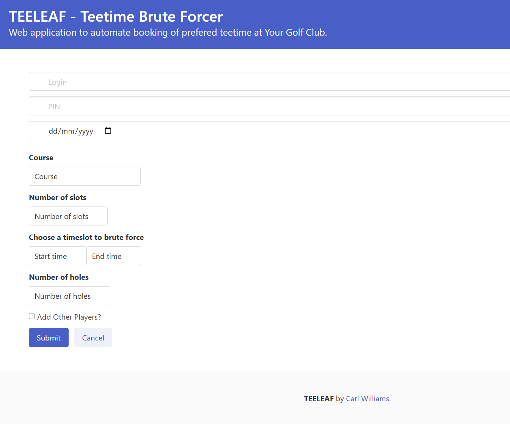

# Teeleaf
Teeleaf is a dockerised python web app that can faciliate auto booking golf tee-times on golf courses wherby they use intelligent golf systems (https://www.intelligentgolf.co.uk/) for those who's golf courses are super busy!

Requires username/password and date/time range of when you want to play.  Teeleaf will attempt to brute force you a timeslot in the range.



## Notes
As I'm too lazy to build the automation into the app it can be used in conjunction with cron.

for example 

```
#!/usr/bin/env python3
from datetime import datetime, timedelta
import calendar
import time
import requests
import logging


# Variables

v_website = 'http://teeleafurl:1912'
s = requests.Session()
logging.basicConfig(format='%(asctime)s %(message)s',
                datefmt='%m/%d/%Y %I:%M:%S %p',
                filename='/var/log/teeleaf/teeleaf.log',
                filemode='w',
                level=logging.DEBUG)
lg = logging.getLogger()
memberid = '<USERNAME>' # Username
pin = '<PASSWORD/PIN>' # Password/Pin
course = 'courseid' # Course ID
numslots = '4' # Number of players


lg.debug("[+] Script init")

# Set day and kick off notifications

date_now_more_14_days = (datetime.now() + timedelta(days=14) ).strftime('%Y-%m-%d')
day = date_now_more_14_days
pbday = datetime.strptime(day, '%Y-%m-%d')
pbday2 = pbday.strftime('%d-%m-%Y')
whatday = calendar.day_name[pbday.weekday()]
lg.debug("[+] Next bookable date set to "+pbday2)

# Set payload and submit
def BookTeeTime(starttime, endtime):
    for attempt in range(3):  # You can adjust the number of attempts as needed
        payload = {"memberid": memberid, "pin": pin, "date": day, "course": course, "numslots": numslots, "starttime": starttime, "endtime": endtime, "numholes": "18" }
        lg.debug("[+] Generating the following payload " + str(payload))
        lg.debug("[+] Attempting slot " + starttime + " - " + endtime)
        r = s.post(v_website + '/result', data=payload)
        if 'Teetime sucessfully booked on' in r.text:
            lg.debug("[+] Success")
            s.close()
            return True
        else:
            lg.debug("[!] Failed")
            s.close()
            if r.status_code == 500:
                lg.debug("[!] Server returned 500. Restarting Teeleaf")
                subprocess.run(("docker", "restart", "teeleaf"))
                time.sleep(5)
                continue  # Retry the booking
            else:
                return False

# Tries
starttime = '11:20'
endtime = '11:28'
lg.debug("[+] Attempting slot 1: "+starttime+" - " +endtime)
if BookTeeTime(starttime, endtime):
    exit()
else:
    starttime = '11:28'
    endtime = '12:00'
    lg.debug("[+] Attempting slot 2: "+starttime+" - " +endtime)
    if BookTeeTime(starttime, endtime):
        exit()
    else:
         starttime = '12:00'
         endtime = '13:04'
         lg.debug("[+] Attempting final slot: "+starttime+" - " +endtime)
         BookTeeTime(starttime, endtime)

```

## Install/Usage

docker-compose up -d

Teeleaf should be running on localhost:1912

## Authors
carl0s
